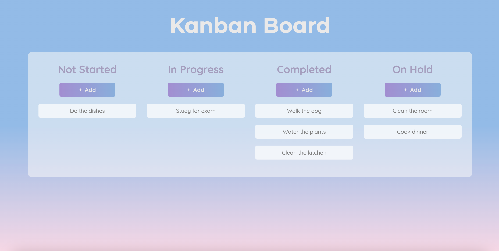

# Description

Kanban Board created with JavaScript and styled CSS to organize multiple tasks.

- Click "+ Add" to add a new task.
- Drag task to change position.
- Double click to delete task.

# Features

- HTML, CSS and JavaScript
- Fully Responsive

# Setup

- Get the code:
- git clone https://github.com/ggmaribel/Kanban-Board